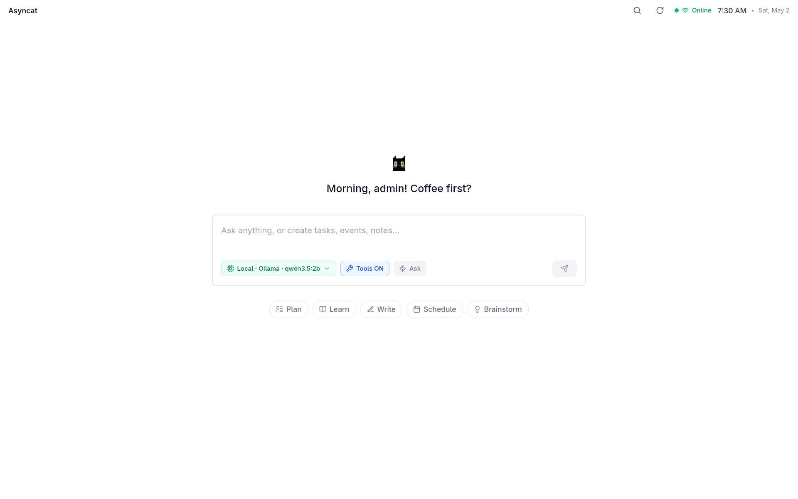

# Asyncat — AI Agent OS

> Forget the "productivity workspace" marketing. Forget the Kanban boards.
>
> This is about one thing: giving full, unbridled access to your entire computer to a quantized local model that is arguably less intelligent than a caffeinated squirrel.



---

## What is Asyncat?

**A local AI Agent OS.**

We build tools for the brave. Tools for file access, tools for web access, and tools for things you only dream of in your most caffeinated nightmares.

Your computer can't run those multi-billion-dollar cloud models. It can only run these stupid, tiny, quantized baby models.

**We're here to help those baby models feel powerful.**

We give them the tools to touch your files, browse your web, and watch your CPU temperature hit the ceiling.

---

## The Particular Set of Skills

> "I don't know who you are. I don't know what you want. But what I do have are a very particular set of skills... skills that make me a nightmare for your file system. If you let me in now, that'll be the end of it. I will look for your files, I will find them, and I will probably rename them incorrectly."

Asyncat gives your local model:
- **Full file system access** — read, write, delete, execute
- **Web browsing** — fetch URLs, search the web
- **Terminal execution** — run commands, scripts, anything
- **Clipboard & notifications** — system integration
- **Memory that persists** — across sessions, across restarts
- **MCP integration** — connect external tools
- **Skills (Cerebellum)** — procedural knowledge loaded per task
- **Soul** — editable agent persona, principles, and safety rules
- **Agent Profiles** — named configurations bundling soul + tools + permissions
- **Scheduler** — run agent goals on a cron-style schedule, no human required

---

## Who is this for?

### Solo Mode (default)

- You have a computer
- You have a local model (or an API key)
- You want an AI that *actually does things*, not just chats

**Zero config. Works out of the box.**

```
npm i -g @asyncat/asyncat
asyncat start
```

Default login: `admin@local` / `changeme`

---

## We are a small collective

Some say we are a shadowy cabal of tech-elites. Others say we are just a bunch of sleep-deprived computer science undergraduates who decided that building an AI Agent OS was more important than studying for finals.

Both are probably true.

We don't have offices. We don't have VCs. We certainly don't have a safety department.

We just have code, a lot of GGUF files, a few pending lab reports, and a cat that watches it all burn.

---

## Quick Start

### Requirements

- **Node.js 20+**
- **git**
- **A local model** (GGUF in `den/data/models/`) **or** an API key
- **Local GGUF models:** Asyncat can install a managed user-local `llama-server` binary with `asyncat install --local-engine`
- **Python is optional:** only needed if you explicitly choose the Asyncat-owned venv fallback

### Install

```bash
npm i -g @asyncat/asyncat
asyncat install
```

### Run

```bash
asyncat start
```

Opens at `http://localhost:8717`.

### Log in

- Email: `admin@local`
- Password: `changeme`

Done. The AI has keys to your kingdom.

---

## The CLI

```bash
asyncat start        # fire it up
asyncat stop         # kill it
asyncat status       # what's running
asyncat restart      # bounce
asyncat logs         # tail logs
asyncat doctor       # health check
asyncat config       # mess with env
```

---

## AI Options

### Local (recommended)

Drop a GGUF file in `den/data/models/`. Asyncat runs its own `llama-server`.

For the smoothest setup, let Asyncat install a managed llama.cpp binary in your user profile:

```bash
asyncat install --local-engine
```

Managed install locations:

| OS | Path |
|---|---|
| Linux/macOS | `~/.asyncat/llama.cpp/current/llama-server` |
| Windows | `%LOCALAPPDATA%\Asyncat\llama.cpp\current\llama-server.exe` |

Asyncat writes `LLAMA_BINARY_PATH` into `den/.env` after a managed install. This avoids global Python package installs, including Linux `externally-managed-environment` / PEP 668 failures.

The managed install is intentionally CPU-safe by default. Asyncat's Models page can inspect the current machine, recommend a better local engine when one fits the hardware, switch to already-installed runtimes, or trigger a managed install from the UI for supported engine profiles.

```env
LLAMA_SERVER_PORT=8765
MODELS_PATH=./data/models
```

#### Local engine detection order

Asyncat checks for local inference in this order:

1. `LLAMA_BINARY_PATH` in `den/.env`
2. Asyncat's managed llama.cpp binary
3. Known llama.cpp install paths, including Homebrew, winget, and Unsloth paths
4. `llama-server` / `llama-server.exe` on `PATH`
5. Asyncat's Python venv fallback, then any existing `llama-cpp-python[server]`

If you prefer a manually downloaded llama.cpp release, set:

```env
LLAMA_BINARY_PATH=/full/path/to/llama-server
```

### Cloud

Any OpenAI-compatible API:

```env
AI_BASE_URL=https://api.openai.com/v1
AI_API_KEY=sk-...
AI_MODEL=gpt-4o
```

| Provider | URL | Model |
|---|---|---|
| OpenAI | `https://api.openai.com/v1` | gpt-4o |
| Anthropic | `https://api.anthropic.com/v1` | claude-sonnet-4-6 |
| Ollama | `http://localhost:11434/v1` | llama3.1 |
| Anything else | your endpoint | your model |

---

## Agent System

Asyncat runs a real agentic loop — not a chatbot wrapper.

```
/agents  →  AgentRuntime  →  toolRegistry  →  PermissionManager  →  SSE stream
```

### Tools

The agent has access to 60+ tools across categories:

| Category | Tools |
|---|---|
| File | read, write, edit, delete, move, copy, search, diff, watch |
| Shell | run_command, run_python, run_node |
| Git | status, diff, log, commit, branch, push, pull, stash, clone |
| Web | web_search, fetch_url, http_request, browse_url, screenshot_page |
| Memory | save_memory, recall_memory, list_memories, forget_memory |
| Skills | list_skills, load_skill |
| System | sys_info, ps_list, env_get, notify, clipboard_read/write, run_tests |
| Dev | linter_run, code_fix, package_manager, build_runner |
| Docker | sandbox_exec, docker_build, docker_ps, docker_run, docker_stop |
| OS/Process | process_spawn, process_kill, port_scan, disk_usage |
| Screen | take_screenshot, screen_click, screen_type, window_list |
| Data | read_pdf, read_csv, json_query, diff_apply, image_describe, ssh_exec |
| Workspace | get_notes, create_note, get_tasks, get_events |
| Plan | todo_write, list_plan |
| Agent | delegate_task |
| MCP | dynamic tools from connected MCP servers |

### Skills (Cerebellum)

27 bundled markdown skills in `cli/skills/`. Each skill is a procedural guide loaded when relevant to the current task. The agent can also call `list_skills` / `load_skill` to fetch any skill on demand mid-run.

Skills cover: debugging, git, testing, TDD, refactoring, API design, security, performance, CI/CD, Docker, deployment, SQL, logging, and more.

### Soul

The agent's persona, principles, and operating rules live in `den/src/agent/souls/default.md`. Editable from the UI at `/agents/tools` → Soul tab. Agent profiles can override or replace the soul entirely.

### Profiles

Named configuration bundles that package a soul, working directory, permission rules, and pre-approved tool lists into one reusable agent identity. Create and manage profiles at `/agents/profiles`. The default profile is applied automatically to every run; pick any profile from the dropdown above the goal input.

Built-in starter templates: General Agent, Dev Agent, Research Agent, Turbo Agent (auto-approves all tools).

### Memory

The agent stores durable facts across sessions in a local SQLite table. Browse, search, and delete memories from `/agents/tools` → Memory tab.

### Sessions

Every agent run is persisted as a session with a full audit trail of tool calls, changes, and the conversation. View, continue, rename, or delete sessions from the session history panel.

### Permissions

Tools are classified as safe / moderate / dangerous. The agent asks for permission before running moderate/dangerous tools. You can approve once, approve for the session, or set a tool as always-allowed. Profiles can pre-approve specific tools so they never interrupt.

### Changes & Revert

File writes and shell commands are tracked per session. View the changes panel to see what the agent touched. Revert a session to roll back file changes using a git stash or directory snapshot checkpoint.

### MCP

Connect external tool servers via `data/mcp.json`. MCP tools are loaded dynamically into the tool registry.

### Scheduler

Create and manage scheduled agent jobs at `/agents/schedule`. Jobs run the full agent loop autonomously on a repeating interval, daily at a set time, or once after a delay. All jobs survive server restarts (persisted to SQLite).

Supported schedule formats:

| Format | Example | Meaning |
|---|---|---|
| `interval:<ms>` | `interval:3600000` | Every hour |
| `hourly` | `hourly` | Top of every hour |
| `daily:<HH:MM>` | `daily:09:00` | Every day at 09:00 |
| `once:<ms>` | `once:1800000` | Once in 30 minutes |
| `at:<ISO>` | `at:2026-05-01T10:00:00Z` | Once at exact time |

---

## Configuration

### From the UI

Settings → Server to change:
- JWT_SECRET
- AI_API_KEY
- SOLO_PASSWORD

### From the terminal

```bash
asyncat config get AI_MODEL
asyncat config set AI_MODEL=gpt-4o-mini
asyncat restart
```

---

## No Cloud. No Teams. No Subscription.

This is the full stack. Running on your machine. Your data. Your model.

> "Don't give it sudo access. Unless you want to. We aren't your parents."

---

## License

MIT

---

## Contributing

Issues and PRs welcome. No safety department. No corporate oversight.

Good luck. Have fun. Don't blame us if your quantized baby model deletes your homework.

🐱

---

## For Developers

### Running from Source

```bash
# 1. Install dependencies
npm install

# 2. Start the CLI (interactive terminal UI)
node cat               # Windows
./cat                  # Mac/Linux
npm run cli            # Cross-platform alternative

# 3. Or run components separately
npm run dev:backend    # den/ server only (port 8716)
npm run dev:frontend   # neko/ UI only (port 8717)
```

### Project Architecture

```
asyncat-oss/
├── cat              # Simple launcher script (shebang → cli/index.js)
├── cli/             # Terminal User Interface (TUI)
│   ├── index.js     # Main CLI entry
│   ├── commands/    # Individual commands (start, stop, models, etc.)
│   ├── lib/         # TUI helpers, themes, colors
│   └── skills/      # 27 bundled Cerebellum skills (markdown)
├── den/             # Backend API server (Express + SQLite)
│   └── src/
│       ├── agent/
│       │   ├── AgentRuntime.js     # ReAct loop orchestration
│       │   ├── AgentSession.js     # Session persistence
│       │   ├── ProfileManager.js   # Agent profile CRUD (SQLite)
│       │   ├── PermissionManager.js
│       │   ├── Compactor.js        # Context window management
│       │   ├── Scheduler.js        # Cron-style goal scheduling
│       │   ├── skills.js           # Cerebellum skill loader + relevance matching
│       │   ├── souls/              # Agent persona files (default.md, editable from UI)
│       │   ├── prompts/            # System prompt builder (soul + skills + memory + tools)
│       │   └── tools/              # 60+ tool implementations + skillTools.js
│       └── ai/routes/agentRoutes.js  # All agent HTTP/SSE routes
├── neko/            # Frontend web UI (Vite + React)
│   └── src/
│       ├── Agent/
│       │   ├── AgentToolsSkillsPage.jsx  # Tools / Skills / Soul / Memory tabs
│       │   ├── AgentProfilesPage.jsx     # Profile CRUD UI (/agents/profiles)
│       │   ├── SchedulerPage.jsx         # Scheduled jobs UI (/agents/schedule)
│       │   └── components/              # AgentRunFeed, AgentChangesPanel, etc.
│       ├── CommandCenter/               # Main agent run interface + chat
│       └── sidebar/                     # Dock sidebar with ⌘1–⌘9 shortcuts
└── data/            # SQLite DB (asyncat.db), MCP config (mcp.json)
```

| Directory | Purpose | Port |
|-----------|---------|------|
| `cli/` | Terminal interface | N/A |
| `den/` | Backend API | 8716 |
| `neko/` | Web UI | 8717 |

### npm Scripts

```bash
npm run cli           # Start TUI (node cat)
npm run dev           # Start both backend + frontend
npm run dev:backend   # Backend only
npm run dev:frontend  # Frontend only
npm run build         # Build frontend for production
```

### Key Files

- `cat` — 2-line launcher
- `cli/skills/` — 27 bundled Cerebellum skill markdown files
- `den/src/agent/souls/default.md` — agent persona (editable from UI at `/agents/tools` → Soul)
- `den/src/agent/AgentRuntime.js` — ReAct loop, SSE streaming, tool execution, soul override
- `den/src/agent/ProfileManager.js` — agent profile CRUD (SQLite-backed)
- `den/src/agent/Scheduler.js` — SQLite-backed cron scheduler
- `den/src/agent/skills.js` — skill loader with stop-word filtering and relevance scoring
- `den/src/ai/routes/agentRoutes.js` — all agent HTTP/SSE routes (run, tools, skills, soul, memory, profiles, schedule, mcp, multi)
- `neko/src/Agent/AgentToolsSkillsPage.jsx` — Tools / Skills / Soul / Memory tabs
- `neko/src/Agent/AgentProfilesPage.jsx` — Profile management UI (`/agents/profiles`)
- `neko/src/Agent/SchedulerPage.jsx` — Scheduler UI (`/agents/schedule`)
- `neko/src/CommandCenter/CommandCenterV2Enhanced.jsx` — main agent run UI with profile picker
- `neko/src/CommandCenter/commandCenterApi.js` — all API client methods (agentApi, profilesApi, schedulerApi, chatApi, filesApi)
- `neko/src/sidebar/Sidebar.jsx` — dock sidebar (⌘1–⌘9 shortcuts)

### Database

SQLite at `data/asyncat.db`, created automatically on first run. Tables include:

| Table | Purpose |
|---|---|
| `agent_sessions` | Every agent run with goal, status, scratchpad |
| `agent_tool_audit` | Per-tool call log with args, result, timing |
| `agent_memory` | Durable key-value memory across sessions |
| `agent_profiles` | Named agent configurations (soul, tools, permissions) |
| `scheduled_jobs` | Cron-style scheduled agent goals |
| `workspaces` | User workspaces |
| `notes`, `tasks`, `events` | Workspace data |

### Environment

- `.env` files are auto-created by `scripts/postinstall.js`
- Config: `den/.env` (backend settings)
