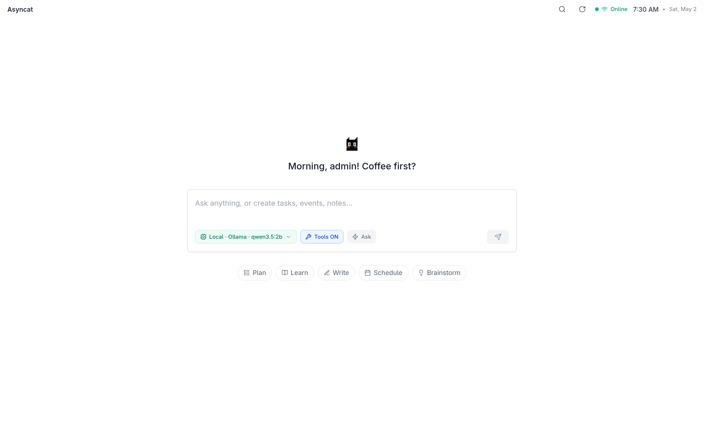

# asyncat

**A local-first AI agent desktop app.** 220+ tools. 51 skills. Self-improving. Desktop automation. Fully offline.

> **v0.8.0-beta.5** · MIT · [Install](#quick-start) · [Website](https://asyncat.com)



---

## What asyncat is

asyncat is a full-stack AI agent you run on your own hardware as a **native desktop application** (powered by Electron). It bundles a backend API engine (`den`) and a React web interface (`neko`) into a single installable app. You connect any model — local or cloud — and it can do real work on your machine.

It is not a chatbot wrapper. It controls your screen, writes and runs code, manages files, schedules recurring jobs, and gets better over time through a self-improving engine called Basal Ganglia.

---

## What's inside

| | |
|---|---|
| **220+ tools** | Files, shell, git, browser, Docker, screen, keyboard, semantic memory, RAG, notes, kanban, system, network, audio, image, design canvases, code analysis, sandboxes, scheduler, workflows, model management, integrations |
| **51 bundled skills** | Reusable instruction modules: code review, debugging, TDD, deployment, security audit, incident response, data engineering, and more |
| **Basal Ganglia** | Watches which tools succeed for which kinds of goals. After 3 successful runs of the same goal pattern with the same set of tools it writes a new skill automatically. No annotation, no config |
| **Chat + agent modes** | **Chat** talks to the model directly (no tools). **Work** runs the agent in `plan` (read-only tools), `action` (full ReAct loop, asks before risky tools) or **Yolo** (`action` with auto-approve). A `design` mode (canvases, artifacts and images; no source edits or shell/git writes) is available through the API |
| **35+ providers** | OpenAI, Anthropic, Gemini, Ollama, llama.cpp, MLX, LM Studio, OpenRouter, DeepSeek, Groq, Together AI, Mistral, Perplexity, Cohere, and more |
| **Agent profiles** | Bundle a soul, working directory, tool permissions, and max rounds into named configurations. Switch profiles per task |
| **Desktop automation** | Click, type, read screen content via OCR, focus windows — controls your actual machine |
| **Sandboxes** | Isolated workspace copies. Review changes as a unified diff. Apply or discard. Commit to a branch |
| **Schedules** | One place for recurring agent jobs and scheduled workflows, with friendly recurrence controls |
| **Workflows** | Chain agent steps into a saved automation. Run on demand or on a cron schedule, under any agent profile. Each step can pass its output to the next. The agent can trigger workflows too |
| **Command palette** | `Cmd/Ctrl+K` from anywhere — jump to any page, or search projects, notes, chats, tasks, and memory |
| **Semantic memory** | Recall by meaning, not just keywords. Uses your provider's embeddings when available, falls back to an offline keyword (hashed lexical) index |
| **Built-in browser** | A real tabbed browser the agent shares. Hand it the page you're on with one click, or let it browse on its own |
| **Activity** | One feed for task agents, scheduled jobs, workflow runs, and outbound notifications |
| **MCP support** | Add stdio MCP servers to `data/mcp.json` in the backend data folder (`den/data/mcp.json` from source, `<user data>/data/mcp.json` when installed). It is created on first start and hot-reloaded. Also manageable through `/api/agent/mcp` (no UI yet) |
| **Persistent memory** | SQLite-backed key-value memory with types: `user`, `feedback`, `project`, `reference`, `fact`, `preference`, `context`, `task_state` |
| **Workspace** | Notes (markdown, delta-based, export to DOCX/PDF), Kanban (columns, cards, checklists) |
| **System tray** | Left-click for quick chat, right-click to show Asyncat, restart the backend, or quit. On macOS, closing the window keeps the backend, schedules, and workflows running |
| **Global shortcuts** | `Cmd/Ctrl+Shift+A` summons Asyncat from any app; `Cmd/Ctrl+Shift+Space` opens quick chat |
| **Native notifications** | System-level alerts when a background run finishes, asks you a question, or needs tool approval |
| **Fully offline** | Every feature works with local models. No data leaves your machine (installed builds only check GitHub Releases for updates) |

---

## Why a desktop app?

Moving from a web app to a native desktop app unlocks things that aren't possible in a browser:

- **Global keyboard shortcut** — `Cmd/Ctrl+Shift+A` brings Asyncat up from anywhere on your machine, whether you're in a code editor, a terminal, or a browser. No alt-tabbing to find the right tab.
- **System tray** — Quick chat is one click away in your menu bar. On macOS, closing the window keeps the agent, schedules, and workflows running in the background; on Windows and Linux, closing the window quits Asyncat.
- **Native notifications** — When a background run finishes, asks you something, or needs approval, you get a real OS notification, not a browser popup that requires a permission grant.
- **No browser security sandbox** — Screen capture, keyboard control, OCR, and desktop automation tools run without the restrictions that a browser tab imposes.
- **Single instance** — One Asyncat, always. The OS prevents you from accidentally opening duplicates.
- **Auto-restart backend** — If the backend crashes, Electron detects it and restarts it automatically. No terminal babysitting.
- **Native menus** — Standard keyboard shortcuts (`Cmd+N` for new chat, `Cmd+,` for settings) work as expected, integrated into the OS menu bar.

---

## Quick Start

### Requirements

**Pre-built installers:** no prerequisites. Download, open, run.

**Run from source:** Node.js `22.13+` or `24+`; npm; git.

### Install & Run

#### 1. Pre-built Installers (Easiest)

Download the latest native package for your system from the **Releases** page:

- **macOS**: `.dmg` (Intel x64 or Apple Silicon arm64)
- **Windows**: `.exe` (x64 NSIS installer)
- **Linux**: `.AppImage` or `.deb` (x64)

> See [Code Signing Warnings](#-code-signing-warnings) below — macOS and Windows will show a security warning on first launch. This is expected for unsigned open-source software. The workarounds are straightforward.

#### 2. Run from Source (Developer Mode)

```bash
# Clone the repository
git clone https://github.com/asyncat-oss/asyncat-oss.git
cd asyncat-oss

# Install dependencies
npm install

# Launch dev server + Electron app
npm run electron:dev

# Same launch with docked Developer Tools opened automatically
npm run electron:dev:tools
```

In dev mode Electron loads the frontend from the Vite dev server (`localhost:8717`), so you get hot module replacement, and uses the backend that `nodemon` runs on port 8716, which restarts when you edit `den/`. Developer Tools are also available at any time from **View → Toggle Developer Tools**.

To work in a regular browser instead, `npm run dev` starts only the backend and the Vite dev server.

#### 3. Build & Package Distributables

```bash
# Build for your current OS
npm run electron:build

# Target specific platforms
npm run electron:build:mac
npm run electron:build:win
npm run electron:build:linux
```

Output packages go into the `release/` directory.

> Native-build note: build on the same OS and CPU architecture as the target. The backend includes native SQLite and Canvas modules, so relabeling a cross-compiled package is unsafe. GitHub Actions builds every published target on a matching native runner.

### Publishing a release

The three package versions (`package.json`, `den/package.json`, and `neko/package.json`) must match the tag. Bump all three, then validate them before tagging (replace `vX.Y.Z-beta.N` with the new version):

```bash
npm install --package-lock-only
npm run release:validate -- vX.Y.Z-beta.N
git tag vX.Y.Z-beta.N
git push origin vX.Y.Z-beta.N
```

The release workflow builds and verifies each native package, creates SHA-256 checksums, and publishes all installers to one GitHub Release. Tags containing a suffix such as `-beta.1` become GitHub prereleases.

---

## Upgrading

### Source installs

```bash
git pull
npm install
npm run electron:dev
```

### Pre-built installers

Asyncat checks published GitHub releases after launch. A dot appears on Settings when a newer version exists. Open **Settings → About**, click **Download installer**, quit Asyncat, and run the installer over the existing installation. The updater selects the asset for the current OS and CPU; settings and local data remain in the OS user-data directory.

Beta builds use assisted installation because they are unsigned. The app will not silently replace itself.

### Uninstalling on Windows

Open **Settings → About → Uninstall Asyncat**, use the **Uninstall Asyncat** shortcut in the Start menu, or open **Windows Settings → Apps → Installed apps → Asyncat → Uninstall**. During an interactive uninstall, choose whether to keep local conversations and settings for a later reinstall or remove Asyncat's local data for a clean uninstall. Attached Project folders stored outside Asyncat's local data folder are not removed.

---

## ⚠️ Code Signing Warnings

asyncat is open-source and does not pay for Apple or Microsoft code signing certificates. When you install a pre-built release, your OS will complain. These are the workarounds:

### macOS

macOS will show: *"Asyncat.app can't be opened because Apple cannot check it for malicious software."*

**Option A (easiest):** Right-click (or Ctrl+click) `Asyncat.app` → choose **Open**. A dialog appears with an **Open** button. Click it.

**Option B:** Open **System Settings** → **Privacy & Security** → scroll to the Security section → click **Open Anyway**.

**Option C (terminal):**
```bash
xattr -cr /Applications/Asyncat.app
```

### Windows

Windows Defender SmartScreen will show: *"Windows protected your PC."*

1. Click **More info**
2. Click **Run anyway**

It only asks once. After that, The Cat is free.

### Linux

No warnings. Linux trusts you to manage your own computer.

```bash
chmod +x Asyncat-*.AppImage
./Asyncat-*.AppImage
```

---

## Keyboard Shortcuts

| Shortcut | Action |
|---|---|
| `Cmd/Ctrl+Shift+A` | Summon or hide Asyncat (global — works in any app) |
| `Cmd/Ctrl+Shift+Space` | Quick chat popup (global) |
| `Cmd/Ctrl+K` | Command palette: jump to a page or search |
| `Cmd/Ctrl+N` | New chat |
| `Cmd/Ctrl+,` | Settings |
| `Cmd/Ctrl+Shift+R` | Restart backend |
| `Cmd/Ctrl+R` | Reload window |
| `Shift+F5` | Force reload window (ignore cache) |

Page navigation shortcuts (`Cmd/Ctrl+1`…) can be changed in **Settings → Appearance**.

---

## After Install

### 1. Add a provider

Go to **Models → LLM** and add an endpoint:

- **Local**: start a local engine (llama.cpp, Ollama, MLX) and select it
- **Cloud**: add OpenAI, Anthropic, Gemini, or any OpenRouter-compatible key

### 2. Open a chat

Start a **New chat** and pick **Chat** (talks to the model directly, no tools) or **Work** (runs the agent). In Work, choose a mode:

- **Plan** — read-only; proposes changes without making them
- **Action** — full ReAct execution loop, asks before risky tools, up to 25 rounds by default
- **Yolo** — Action with every tool auto-approved

### 3. Run scheduled tasks

Go to **Schedules** and create repeating agent jobs — daily reports, hourly checks, custom cron expressions.

### 4. Manage skills and memory

Go to **Tools & Skills** to browse the tool inventory, load skill modules, edit agent soul, and review memory entries.

---

## Architecture

```text
asyncat-oss/
├── electron/        # Electron desktop app wrapper (see electron/README.md)
│   ├── main.js      #   App entry: boot sequence, IPC, global shortcuts, static frontend server
│   ├── backend.js   #   Spawns den (bundled Node.js when packaged, system Node in dev)
│   ├── window.js    #   BrowserWindow creation and loading screen
│   ├── tray.js      #   System tray icon and menu
│   ├── popup.js     #   Quick-chat popup
│   ├── pet.js       #   Optional desktop companion that shows agent status
│   ├── updater.js   #   Assisted update checks against GitHub Releases
│   ├── menu.js      #   Native OS menu bar
│   ├── preload.js   #   Secure renderer ↔ main bridge
│   └── constants.js #   Paths, ports, platform flags
├── den/             # Backend — Express API + Agent Runtime
│   ├── src/
│   │   ├── index.js           # Server entry (routes, DB, CORS, SSE streaming)
│   │   ├── agent/             # AgentRuntime, BasalGanglia, tools, skills, souls,
│   │   │                      #   sessions, SandboxManager, Scheduler, profiles
│   │   ├── ai/                # Providers, local engines, chat/agent/training routes
│   │   ├── browser/           # Built-in browser history (/api/browser)
│   │   ├── config/            # Config + secrets API (/api/config)
│   │   ├── db/                # SQLite client + schema
│   │   ├── files/             # File explorer service (/api/files)
│   │   ├── install/           # Runtime readiness checks (/api/install)
│   │   ├── integrations/      # GitHub, Obsidian, RSS, mail, outbound notifications
│   │   ├── kanban/            # Cards + columns (/api/cards, /api/columns)
│   │   ├── lib/               # Shared helpers: .env I/O, system deps, engine installs
│   │   ├── middleware/        # Local profile context, cross-site request guard
│   │   ├── notes/             # Delta-based notes, export (/api/notes)
│   │   ├── search/            # Universal search (/api/search)
│   │   ├── storage/           # Uploaded files (/files, /api/storage)
│   │   ├── update/            # Update status and graceful restart (/api/update)
│   │   └── users/             # Local profile + workspace/project CRUD
│   ├── data/                  # SQLite DB, uploads, MCP config (created at runtime)
│   └── test/                  # node:test suites (npm test -w den)
├── neko/            # React + Vite frontend
│   └── src/
│       ├── CommandCenter/     # Chat and agent runs
│       ├── Agent/             # Agents page (profiles)
│       ├── Models/            # LLM providers, local models and runtimes, audio, images
│       ├── Profiles/          # Agent profiles
│       ├── Scheduler/         # Unified Schedules UI
│       ├── Workflows/         # Workflow builder
│       ├── Activity/          # Background activity feed
│       ├── Tools/             # Tools & skills browser
│       ├── Training/          # Fine-tuning jobs
│       ├── Settings/          # Settings tabs
│       ├── projects/          # Projects
│       ├── sidebar/           # Sidebar and Cmd/Ctrl+K search
│       ├── notes/             # Notes editor
│       └── views/             # Kanban, list, tasks
├── scripts/         # Install, icon, Node bundling, and release scripts
├── build/           # Windows installer customization (installer.nsh)
└── electron-builder.yml # Electron desktop packaging configuration
```

### How the desktop app boots

```text
Electron starts
  → electron/main.js — single-instance lock, IPC, updater, menu, tray, global shortcuts
  → creates the window and shows the loading screen
  → electron/backend.js — spawns den/src/index.js (bundled Node.js when packaged,
    system Node in dev; dev scripts reuse the nodemon backend instead)
  → polls /health until the backend is ready (30s timeout; on failure a dialog
    offers the diagnostic logs and the app continues)
  → starts the static frontend server (neko/dist/) on port 8717 unless Vite is running
  → BrowserWindow loads http://127.0.0.1:8717 (packaged) or http://localhost:8717 (Vite)
  → sends 'backend:ready' (or 'backend:error') IPC event to the renderer
```

### Agent runtime flow

```text
User goal
  → AgentRuntime.run() — ReAct loop (up to 25 rounds)
  → System prompt: soul + skills + memory + capabilities
  → Any model provider (local or cloud)
  → Tool execution with permission guards
  → BasalGanglia observes patterns, synthesizes skills
  → AgentSession persists audit trail
  → Results streamed to browser via SSE
```

---

## Basal Ganglia — how self-improvement works

asyncat watches which tools succeed for which kinds of goals. A pattern is the goal's key words plus the set of tools used (order doesn't matter). When the same pattern succeeds three times, the Basal Ganglia module writes a new `auto-…` skill to `~/.asyncat/skills` and uses it from then on — no annotation, no manual configuration.

Failures and user corrections get encoded into corrective memory. The agent avoids patterns that have been flagged without being told explicitly.

```
session #41  "fix failing parser tests"   read_file, edit_file, run_tests  ✓
session #44  "fix failing auth tests"     read_file, edit_file, run_tests  ✓
session #47  "fix failing tests"          read_file, edit_file, run_tests  ✓

[basal-ganglia] Created skill: auto-fix-failing-tests
                brain_region basal-ganglia · weight 0.8
```

---

## Troubleshooting

### "Backend Start Failed" or a blank window

The backend or the frontend server could not start. Check:

1. **Are ports 8716 (backend) and 8717 (frontend) free?** `lsof -i :8716 -i :8717` (macOS/Linux) or `netstat -ano | findstr "8716 8717"` (Windows).
2. **Read the backend log**: `den/logs/backend-process.log` from source, or `logs/backend-process.log` in Asyncat's user-data folder for installed builds (the error dialog's **Open diagnostic logs** button opens it).
3. **Open the developer console** — in the app: `View → Toggle Developer Tools` — and check for errors.

### `better-sqlite3` crashes or fails to load

The backend native modules must be compiled for the system Node.js version used during installation:

```bash
npm rebuild better-sqlite3 canvas
```

Do not rebuild these backend modules against Electron; packaged builds run them with the separately bundled Node.js runtime.

### Tray icon missing on Linux

Some Linux distributions need `libappindicator`:

```bash
sudo apt install libappindicator1
# or
sudo apt install libayatana-appindicator1
```

### Assisted desktop updates (Settings → About)

Packaged builds check GitHub Releases automatically and open the exact installer for their OS and CPU. Quit Asyncat and install the downloaded version over the existing app. Source installations continue to update with `git pull` and `npm install`.

---

## Status

**asyncat is a mature beta.** It has been built and tested across real agent sessions covering coding, research, system administration, scheduling, and desktop automation tasks.

**Active development:**
- [ ] Multi-platform clients (Telegram, Slack)
- [ ] API/SDK for programmatic access
- [ ] Extended MCP ecosystem compatibility

---

## License

MIT — use it, fork it, build on it.
