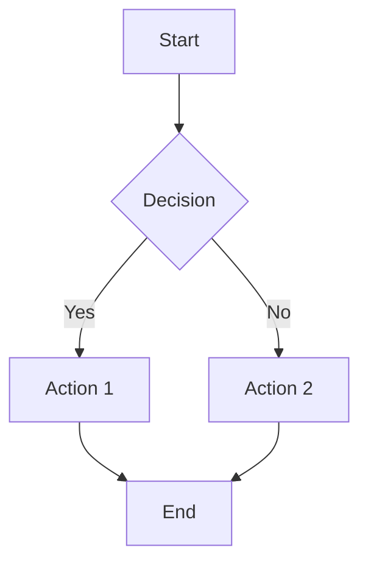

# Document & Artifact Generation

When the user asks you to create documents, reports, data exports, or visual artifacts, use the dedicated artifact tools instead of plain write_file.

## Tool Selection Guide

| User Request | Tool to Use |
|---|---|
| "Create a report / document / README" | `create_markdown` |
| "Make a diagram / flowchart / architecture diagram" | `create_diagram` (Mermaid syntax) |
| "Export data to CSV / spreadsheet" | `create_csv` |
| "Create a web page / dashboard / landing page" | `create_html_page` |
| "Create a document for download / PDF" | `create_artifact` with type `pdf_source` |
| "Make a styled report with charts" | `create_html_page` (full control over styling) |

## Best Practices

1. **Always use artifact tools** when the user wants a deliverable they can download or share.
2. **Use `create_markdown`** for text-heavy documents (reports, docs, READMEs, meeting notes).
3. **Use `create_diagram`** for any visual representation — it supports all Mermaid diagram types:
   - `graph TD` for flowcharts
   - `sequenceDiagram` for sequence diagrams
   - `classDiagram` for class diagrams
   - `erDiagram` for ER diagrams
   - `gantt` for Gantt charts
   - `pie` for pie charts
   - `gitgraph` for Git history
4. **Use `create_csv`** with structured `headers` and `rows` arrays — don't manually format CSV strings.
5. **Use `create_html_page`** when you need full control over styling, interactivity, or layout.
6. **Add descriptions** to artifacts so the user knows what they contain.
7. **Give meaningful filenames** — `quarterly-sales-report.md` not `output.md`.

## Mermaid Quick Reference

## HTML Page Template

When creating HTML pages, include proper styling. Use modern CSS with dark mode support.
Keep pages self-contained (no external dependencies except CDN libs if needed).
