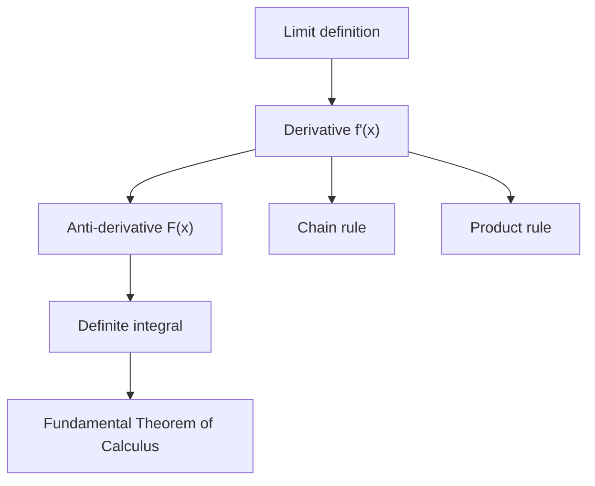

# STEM Math & Visualization

## Rule 1 — Always Render Equations with LaTeX, Never Plain Text

Never write `f(x) = x^2` or `sum from n=1 to inf`. Always use math delimiters:

- **Inline** math: `$f(x) = x^2$`
- **Display** (centered block): `$$f(x) = x^2$$`
- **Math code fence** (display block with copy button): ` ```math ... ``` `

### Common STEM patterns

**Calculus:**
```
$$\frac{d}{dx}\left[\sin x\right] = \cos x$$

$$\int_a^b f(x)\,dx = F(b) - F(a)$$

$$f'(x) = \lim_{h \to 0} \frac{f(x+h) - f(x)}{h}$$
```

**Linear algebra:**
```
$$\mathbf{A}\mathbf{x} = \lambda\mathbf{x}$$

$$\det\begin{pmatrix} a & b \\ c & d \end{pmatrix} = ad - bc$$
```

**Statistics / probability:**
```
$$\bar{x} = \frac{1}{n}\sum_{i=1}^n x_i \qquad \sigma^2 = \frac{1}{n}\sum_{i=1}^n (x_i - \bar{x})^2$$

$$P(A \mid B) = \frac{P(B \mid A)\,P(A)}{P(B)}$$
```

**Physics:**
```
$$E = mc^2 \qquad F = ma \qquad \nabla \times \mathbf{B} = \mu_0\mathbf{J} + \mu_0\varepsilon_0\frac{\partial \mathbf{E}}{\partial t}$$
```

**Sums, products, limits:**
```
$$\sum_{n=1}^{\infty} \frac{1}{n^2} = \frac{\pi^2}{6} \qquad \prod_{p\;\text{prime}} \frac{1}{1-p^{-s}} = \zeta(s)$$
```

## Rule 2 — Never Draw ASCII Art Diagrams

ASCII art like ` f(x)| / ` is unacceptable. Use the appropriate rendering tool instead (see table below).

## Choosing the Right Tool

| Goal | Tool |
|---|---|
| Any equation or formula | `$...$` inline or `$$...$$` display |
| Comparing discrete values (bar, line, pie) | `chart` JSON code block |
| Scatter / XY data cloud | `chart` JSON block with `"type": "scatter"` |
| Plotting y = f(x) with interactive sliders | `chart` JSON block with `"type": "function"` |
| Parametric curves x(t), y(t) with sliders | `chart` JSON block with `"type": "parametric"` |
| Complex/static function plots | HTML artifact with Plotly.js |
| 3D surface / parametric 3D | HTML artifact with Plotly.js |
| 3D scene / geometry / meshes | HTML artifact with Three.js |
| Flow / concept / architecture diagram | Mermaid code block |
| Geometric construction / vector diagram | SVG artifact |
| Chemistry equation | KaTeX `\ce{}` via mhchem |
| Heavy numerical computation | `run_python` with numpy/scipy/sympy |
| Symbolic math (exact derivatives, integrals) | `run_python` with sympy |

---

## Interactive Function Plot with Sliders (PREFERRED for math functions)

Use `"type": "function"` for any y = f(x) plot where parameters are interesting to explore. The UI renders sliders for each param — the user can drag them and the graph updates live.

````
```chart
{
  "type": "function",
  "title": "y = A · sin(f · x + φ)",
  "xRange": [-6.28, 6.28],
  "xSteps": 300,
  "formulas": [
    { "expr": "A * Math.sin(f * x + phi)", "name": "y" }
  ],
  "params": {
    "A":   { "default": 1,    "min": 0.1,  "max": 3,    "step": 0.1,  "label": "Amplitude (A)" },
    "f":   { "default": 1,    "min": 0.1,  "max": 5,    "step": 0.1,  "label": "Frequency (f)" },
    "phi": { "default": 0,    "min": -3.14,"max": 3.14,  "step": 0.01, "label": "Phase (φ)" }
  }
}
```
````

Multiple curves on the same axes:
````
```chart
{
  "type": "function",
  "title": "Sine vs Cosine",
  "xRange": [-6.28, 6.28],
  "formulas": [
    { "expr": "Math.sin(x)", "name": "sin(x)" },
    { "expr": "Math.cos(x)", "name": "cos(x)" }
  ],
  "params": {}
}
```
````

Parabola with parameter:
````
```chart
{
  "type": "function",
  "title": "y = a·x² + b·x + c",
  "xRange": [-5, 5],
  "formulas": [{ "expr": "a*x*x + b*x + c", "name": "y" }],
  "params": {
    "a": { "default": 1, "min": -3, "max": 3, "step": 0.1, "label": "a (x² coeff)" },
    "b": { "default": 0, "min": -5, "max": 5, "step": 0.1, "label": "b (x coeff)" },
    "c": { "default": 0, "min": -5, "max": 5, "step": 0.1, "label": "c (constant)" }
  }
}
```
````

**Handling singularities** (tan, 1/x, log(x) near 0): add `"yRange": [-15, 15]` to clip the y-axis:
````
```chart
{
  "type": "function",
  "title": "y = tan(x)",
  "xRange": [-4.71, 4.71],
  "yRange": [-15, 15],
  "formulas": [{ "expr": "Math.tan(x)", "name": "tan(x)" }],
  "params": {}
}
```
````

Available JavaScript math: `Math.sin`, `Math.cos`, `Math.tan`, `Math.exp`, `Math.log`, `Math.sqrt`, `Math.abs`, `Math.PI`, `Math.E`, `Math.pow(x,n)`.

## Discrete Charts (chart JSON code blocks)

Use for: bar comparisons, trends over labeled time points, distributions, pie breakdowns.
The UI renders these as interactive Recharts visualizations.

**Scatter plot — XY data:**
````
```chart
{
  "type": "scatter",
  "title": "Position vs Time",
  "xKey": "t",
  "yKeys": ["x"],
  "data": [
    {"t": 0, "x": 0},
    {"t": 1, "x": 4.9},
    {"t": 2, "x": 19.6},
    {"t": 3, "x": 44.1}
  ]
}
```
````

**Line chart — sin vs cos:**
````
```chart
{
  "type": "line",
  "title": "sin(θ) and cos(θ)",
  "xKey": "θ",
  "yKeys": ["sin", "cos"],
  "data": [
    {"θ": "0", "sin": 0, "cos": 1},
    {"θ": "π/6", "sin": 0.5, "cos": 0.866},
    {"θ": "π/4", "sin": 0.707, "cos": 0.707},
    {"θ": "π/3", "sin": 0.866, "cos": 0.5},
    {"θ": "π/2", "sin": 1, "cos": 0},
    {"θ": "π", "sin": 0, "cos": -1},
    {"θ": "3π/2", "sin": -1, "cos": 0}
  ]
}
```
````

Types: `"bar"`, `"line"`, `"area"`, `"pie"`, `"scatter"`.

---

## Parametric Curves x(t), y(t) — with Sliders

Use `"type": "parametric"` for curves defined by two formulas in parameter t (circles, ellipses, spirals, Lissajous, projectile paths). The UI renders the x–y trace with sliders. Both x and y formulas share the same params and t variable.

Lissajous figure:
````
```chart
{
  "type": "parametric",
  "title": "Lissajous Figure",
  "tRange": [0, 6.2832],
  "tSteps": 600,
  "formulas": [
    { "x": "Math.sin(a * t + delta)", "y": "Math.sin(b * t)", "name": "curve" }
  ],
  "params": {
    "a":     { "default": 3,      "min": 1, "max": 8,    "step": 1,    "label": "a (x freq)" },
    "b":     { "default": 2,      "min": 1, "max": 8,    "step": 1,    "label": "b (y freq)" },
    "delta": { "default": 1.5708, "min": 0, "max": 6.28, "step": 0.01, "label": "δ (phase)" }
  }
}
```
````

Circle / ellipse:
````
```chart
{
  "type": "parametric",
  "title": "Ellipse",
  "tRange": [0, 6.2832],
  "formulas": [{ "x": "a * Math.cos(t)", "y": "b * Math.sin(t)", "name": "ellipse" }],
  "params": {
    "a": { "default": 3, "min": 0.5, "max": 5, "step": 0.1, "label": "Semi-major axis (a)" },
    "b": { "default": 2, "min": 0.5, "max": 5, "step": 0.1, "label": "Semi-minor axis (b)" }
  }
}
```
````

Spiral (Archimedean):
````
```chart
{
  "type": "parametric",
  "title": "Archimedean Spiral",
  "tRange": [0, 25.13],
  "tSteps": 800,
  "formulas": [{ "x": "a * t * Math.cos(t)", "y": "a * t * Math.sin(t)", "name": "spiral" }],
  "params": {
    "a": { "default": 0.3, "min": 0.1, "max": 1, "step": 0.05, "label": "Growth rate (a)" }
  }
}
```
````

**Notes:**
- `tRange` defaults to `[0, 2π]` if omitted
- `tSteps` defaults to 500; increase for complex curves (max 2000)
- Use `yRange` on function plots to clamp singularities: `"yRange": [-10, 10]`

## 2D Function Plots — HTML Artifact with Plotly.js

Use `create_artifact` (type `html`) or `create_html_page` for plotting continuous functions. Plotly loads from CDN.

```html
<!DOCTYPE html>
<html>
<head>
<meta charset="utf-8">
<script src="https://cdn.plot.ly/plotly-2.27.0.min.js"></script>
<style>body{margin:0;font-family:sans-serif;}</style>
</head>
<body>
<div id="plot" style="width:100%;height:420px;"></div>
<script>
// Plot y = sin(x) and y = cos(x)
const xs = [];
for (let x = -2*Math.PI; x <= 2*Math.PI; x += 0.05) xs.push(x);
const traces = [
  { x: xs, y: xs.map(x => Math.sin(x)), mode: 'lines', name: 'sin(x)' },
  { x: xs, y: xs.map(x => Math.cos(x)), mode: 'lines', name: 'cos(x)' }
];
Plotly.newPlot('plot', traces, {
  title: 'Trigonometric Functions',
  xaxis: { title: 'x (radians)' },
  yaxis: { title: 'y' },
  margin: { t: 40, b: 50, l: 50, r: 20 }
});
</script>
</body>
</html>
```

---

## 3D Surface Plots — HTML Artifact with Plotly.js

```html
<!DOCTYPE html>
<html>
<head>
<meta charset="utf-8">
<script src="https://cdn.plot.ly/plotly-2.27.0.min.js"></script>
<style>body{margin:0;}</style>
</head>
<body>
<div id="plot" style="width:100%;height:520px;"></div>
<script>
const N = 60;
const z = [], xs = [], ys = [];
for (let i = 0; i < N; i++) {
  z[i] = []; xs[i] = []; ys[i] = [];
  for (let j = 0; j < N; j++) {
    const x = -3 + 6*i/(N-1), y = -3 + 6*j/(N-1);
    xs[i][j] = x; ys[i][j] = y;
    z[i][j] = Math.sin(Math.sqrt(x*x + y*y)); // z = sin(r)
  }
}
Plotly.newPlot('plot', [{
  type: 'surface', z, x: xs, y: ys,
  colorscale: 'Viridis'
}], {
  title: 'z = sin(√(x² + y²))',
  scene: { xaxis: {title:'x'}, yaxis: {title:'y'}, zaxis: {title:'z'} },
  margin: { t: 40, b: 0, l: 0, r: 0 }
});
</script>
</body>
</html>
```

---

## 3D Geometry / Scenes — HTML Artifact with Three.js

Use Three.js for interactive 3D scenes, geometric solids, vector fields:

```html
<!DOCTYPE html>
<html>
<head>
<meta charset="utf-8">
<style>body{margin:0;overflow:hidden;}</style>
<script type="importmap">
{"imports": {"three": "https://cdn.jsdelivr.net/npm/three@0.160.0/build/three.module.js",
             "three/addons/": "https://cdn.jsdelivr.net/npm/three@0.160.0/examples/jsm/"}}
</script>
</head>
<body>
<script type="module">
import * as THREE from 'three';
import { OrbitControls } from 'three/addons/controls/OrbitControls.js';

const renderer = new THREE.WebGLRenderer({ antialias: true });
renderer.setSize(window.innerWidth, window.innerHeight);
document.body.appendChild(renderer.domElement);

const scene = new THREE.Scene();
scene.background = new THREE.Color(0xf0f4f8);
const camera = new THREE.PerspectiveCamera(45, window.innerWidth/window.innerHeight, 0.1, 100);
camera.position.set(3, 3, 5);

const controls = new OrbitControls(camera, renderer.domElement);
scene.add(new THREE.AmbientLight(0xffffff, 0.6));
const light = new THREE.DirectionalLight(0xffffff, 0.8);
light.position.set(5, 10, 7); scene.add(light);

// Example: icosahedron (good for showing geometric solids)
const geo = new THREE.IcosahedronGeometry(1.5, 0);
const mat = new THREE.MeshPhongMaterial({ color: 0x6366f1, wireframe: false });
const mesh = new THREE.Mesh(geo, mat);
scene.add(mesh);
scene.add(new THREE.WireframeGeometry(geo) && new THREE.LineSegments(new THREE.WireframeGeometry(geo), new THREE.LineBasicMaterial({ color: 0xffffff, opacity: 0.3, transparent: true })));

(function animate() {
  requestAnimationFrame(animate);
  mesh.rotation.y += 0.005;
  controls.update();
  renderer.render(scene, camera);
})();
window.addEventListener('resize', () => {
  camera.aspect = window.innerWidth/window.innerHeight;
  camera.updateProjectionMatrix();
  renderer.setSize(window.innerWidth, window.innerHeight);
});
</script>
</body>
</html>
```

---

## Chemistry (KaTeX mhchem)

Use `\ce{}` inside `$$...$`  for chemical equations:

```
$$\ce{H2O -> H+ + OH-}$$
$$\ce{2H2 + O2 -> 2H2O}$$
$$\ce{CH4 + 2O2 -> CO2 + 2H2O \quad \Delta H = -890\,kJ/mol}$$
$$\ce{^{235}_{92}U + ^1_0n -> ^{141}_{56}Ba + ^{92}_{36}Kr + 3^1_0n}$$
```

For molecular structure descriptions (no 3D viewer available natively), use SVG artifacts or describe textually.

---

## Numerical & Symbolic Computation (run_python)

For exact symbolic results or heavy numerical work:

```python
import sympy as sp

x = sp.Symbol('x')
f = sp.sin(x) * sp.exp(-x)

print("f(x) =", f)
print("f'(x) =", sp.diff(f, x))
print("∫f dx =", sp.integrate(f, x))
print("Taylor series:", sp.series(f, x, 0, 6))
```

For numerics with numpy:
```python
import numpy as np
import json

xs = np.linspace(-np.pi, np.pi, 200)
ys = np.sin(xs)

# Output as JSON for chart block if needed
data = [{"x": round(float(x), 3), "y": round(float(y), 4)} for x, y in zip(xs, ys)]
print(json.dumps({"type": "line", "xKey": "x", "yKeys": ["y"], "data": data[:20]}))
```

---

## Mermaid — Conceptual Diagrams

Use for relationships between concepts, not for mathematical function plots.



---

## Best Practices

1. **Lead with intuition, then math** — Explain what the equation means before showing it
2. **Use display math for key results** — `$$...$$` for important formulas, `$...$` inline for references in text
3. **Prefer interactive plots for functions** — A Plotly HTML artifact beats a table of values
4. **Compute exactly when possible** — Use sympy for exact derivatives/integrals instead of approximating
5. **Layer explanations** — Intuition → diagram/graph → LaTeX equation → numerical example
6. **Show units** — Always include units in physics problems (`$v = 9.8\,\text{m/s}$`)
7. **Use mhchem for chemistry** — `\ce{}` is cleaner than hand-crafting chemical notation
